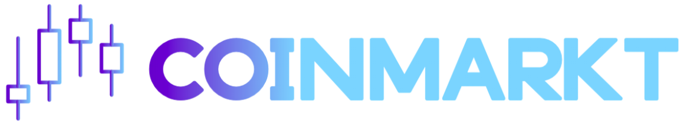

`coinmarkt` is an Android app to get accurate cryptocurrencies and exchanges data from CoinGecko, you also get news from various sources.

Feel free to contribute, I'm still learning Android development and Kotlin.

## Getting started

You can use Android Studio or IntelliJ IDEA to work with this repository.

Or you can clone the repository manually :
`git clone https://github.com/beamop/coinmarkt.git`

## Features

- Cryptocurrencies listing
	- Change (24h)
	- Sparkline
	- Price (USD)
- Cryptocurrencies details
	- Line chart
	- Price (USD)
	- Rank
	- Volume
	- Variation (24h)
	- Low / Hight (24)
- Exchanges listing
	- Trust score
	- Change (24h)
	- Redirect to website on click
- Latest news
	- Aggregated top cryptocurrency articles
	- Redirect to article on click

## Architecture
Coinmarkt is based on MVVM architecture and a repository pattern.

## Acknowledgements

CoinGecko.com for providing free access to the API :rocket:
CryptoControl.io for providing high quality news API :newspaper:

And all the dependencies used in this project, you can get the full list using :
`gradle app:dependencies`
